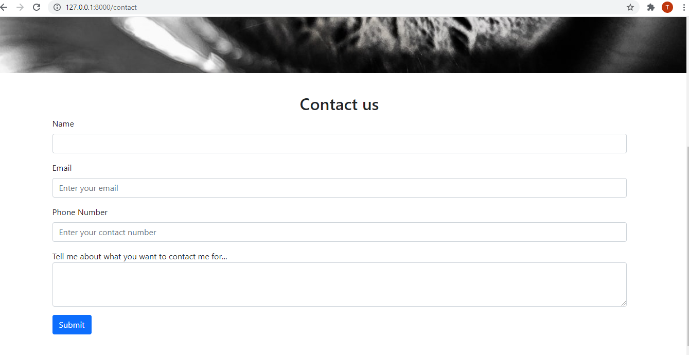

# Python-Django-Project
This project is made using python+django

1.```python -m venv env```
creates virtual enviroment

2.```python manage.py makemigrations```
generates the SQL commands for preinstalled app

3.```python manage.py migrate```
migrate executes those SQL commands in the database file

3.```Python manage.py migrate --run-syncdb```
reconstruct database schema according to altered model fields(not necessary)

4.```python manage.py createsuperuser```
It will create an admin superuser with all Administrative privileges

5.```python manage.py runserver```
runs the server on localhost.
127.0.0.1:8000

Home page


Select Package page


About Us page
